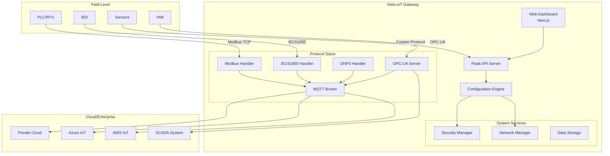
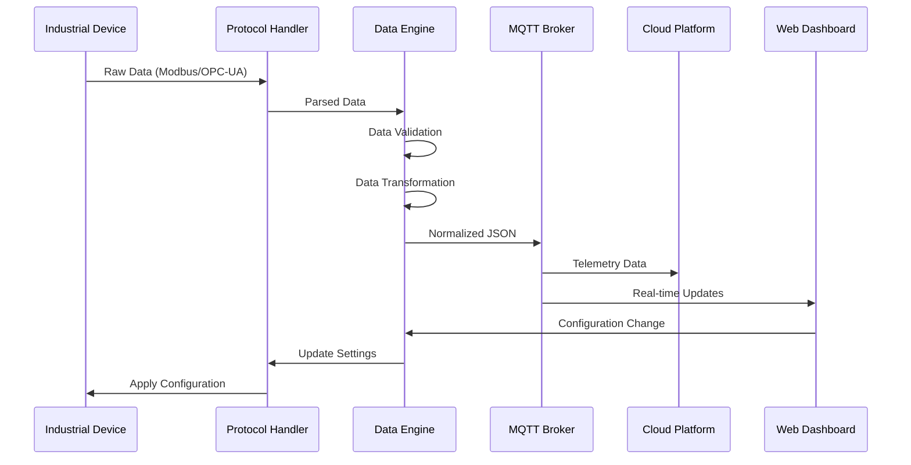
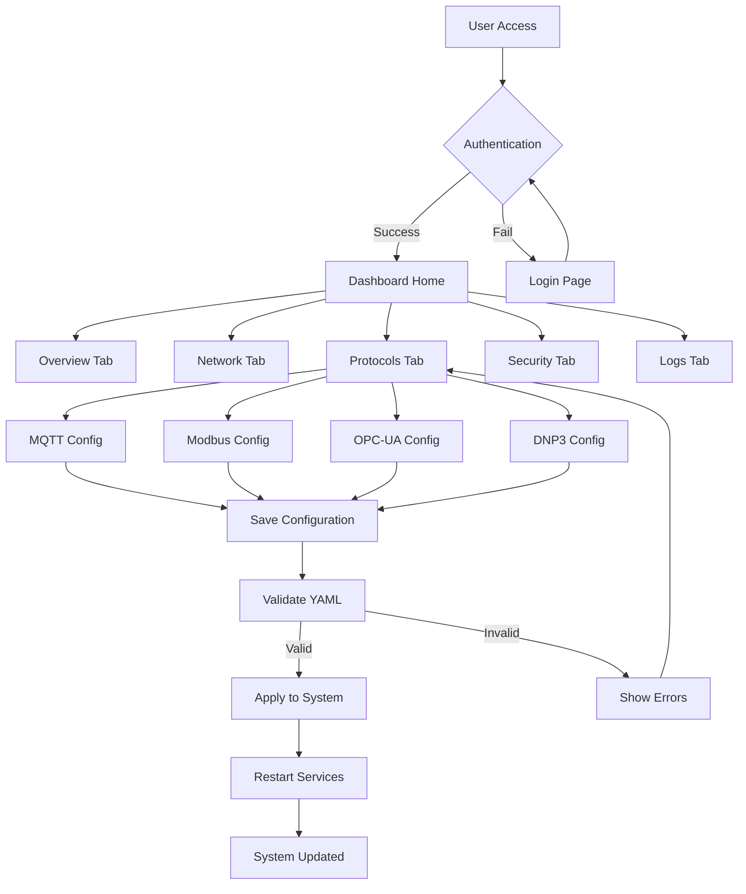
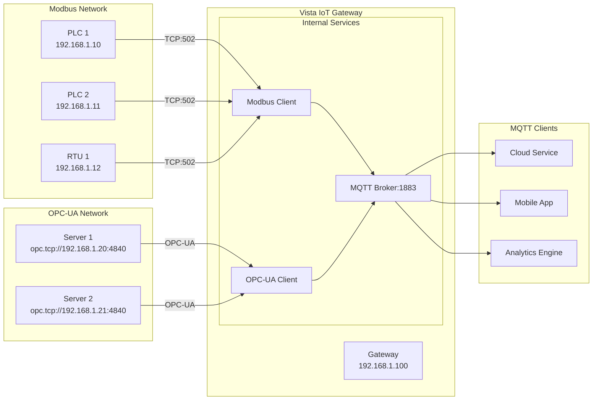
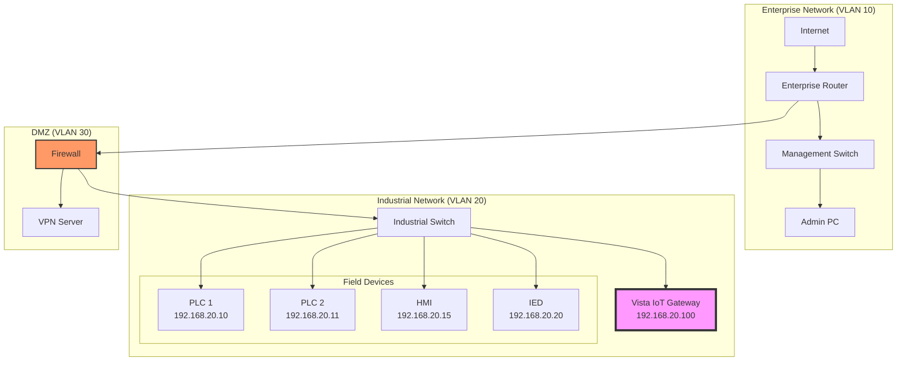
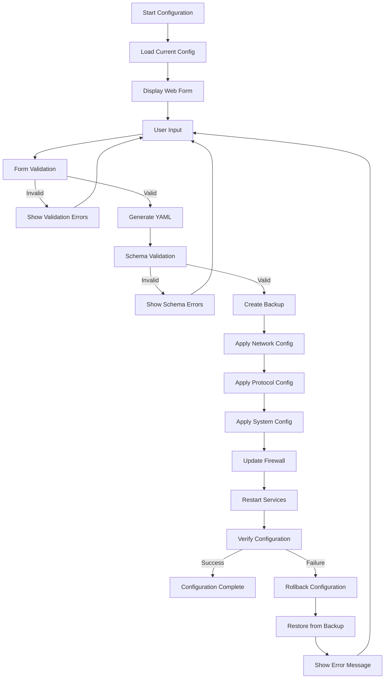
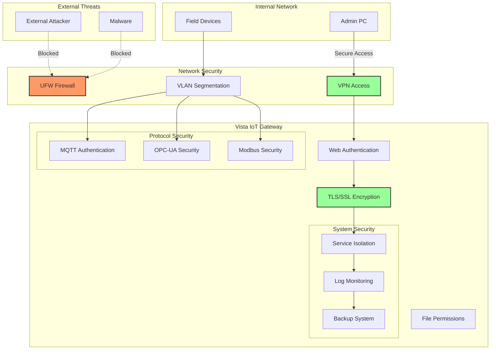

# Vista IoT Gateway Architecture

Comprehensive overview of the Vista IoT Gateway platform architecture, designed as a self-contained industrial IoT solution.

<div align="center">
  
</div>

## 🏗️ System Overview

The Radxa IoT Gateway is engineered as a **modular, industrial-grade IoT platform** that runs entirely on Radxa Single Board Computers. It provides a complete alternative to commercial solutions like Advantech Edge Link Studio.

### 🎯 Design Principles

- **Self-Contained**: No external cloud dependencies required
- **Industrial Grade**: Built for 24/7 operation in harsh environments
- **Protocol Agnostic**: Support for multiple industrial communication protocols
- **Web-First**: Complete configuration through web interface
- **Modular**: Easy to extend with additional protocols and features

## 🖥️ Core Architecture

```
┌─────────────────────────────────────────────────────────────────────────────┐
│                        Web Dashboard (Next.js)                        │
│                     http://radxa-ip:8080                             │
└─────────────────────────────────────┬─────────────────────────────────────────┘
                                 │ REST API / WebSocket
                                 │
┌─────────────────────────────────────▼─────────────────────────────────────────┐
│                          Flask API Server                            │
│                        (app.py - Port 8080)                         │
└─────────────────────────────────────┬─────────────────────────────────────────┘
                                 │ YAML Configuration
                                 │
┌─────────────────────────────────────▼─────────────────────────────────────────┐
│                   Configuration Engine                             │
│                  (gateway_configurator.py)                        │
└──────────┬───────────────────┬───────────────────┬───────────────────┘
          │                   │                   │
          ▼                   ▼                   ▼
┌──────────┐   ┌───────────────────┐   ┌───────────────────┐
│ Network  │   │   Protocol Stack     │   │   System Stack     │
│ Manager  │   │                   │   │                   │
└──────────┘   └───────────────────┘   └───────────────────┘
          │                   │                   │
          ▼                   ▼                   ▼
 ┌─────────┐              ┌────────────┐      ┌────────────┐
 │Ethernet │              │MQTT:1883    │      │Hostname    │
 │WiFi     │              │Modbus:502   │      │Firewall    │
 │Firewall │              │OPC-UA:4840  │      │NTP Sync    │
 │DNS      │              │DNP3:20000   │      │Logging     │
 └─────────┘              │IEC61850     │      │Services    │
                          └────────────┘      └────────────┘
```

## 🔧 Core Components

### 1. Web Dashboard (Frontend)

**Technology Stack:**
- **Next.js 14**: React framework with server-side rendering
- **TypeScript**: Type-safe development
- **Tailwind CSS**: Utility-first CSS framework
- **Radix UI**: Accessible component primitives
- **Zustand**: Lightweight state management
- **React Hook Form + Zod**: Form handling and validation

**Key Features:**
- Real-time system monitoring
- Protocol configuration interfaces
- Network settings management
- YAML configuration editor with Monaco
- Responsive design for mobile/tablet access

### 2. Flask API Server (Backend)

**Core Services:**
- **Configuration API**: CRUD operations for gateway settings
- **WebSocket Server**: Real-time updates and monitoring
- **Static File Serving**: Hosts the built Next.js application
- **Authentication**: User session management

**File Structure:**
```
/opt/radxa-gateway/
├── app.py                    # Main Flask application
├── config/
│   ├── gateway.yaml           # Main configuration
│   ├── modbus.json           # Modbus-specific config
│   └── opcua.json            # OPC-UA-specific config
├── web-dashboard/out/         # Built frontend
├── logs/                     # Application logs
└── data/                     # Runtime data
```

### 3. Configuration Engine

**Purpose:** Translates YAML configuration into system-level changes

**Capabilities:**
- **Network Configuration**: Ethernet, WiFi, static/DHCP
- **Service Management**: Systemd service creation and management
- **Protocol Setup**: Configure protocol-specific settings
- **Firewall Rules**: UFW configuration
- **System Settings**: Hostname, timezone, NTP

**Configuration Flow:**
```
Web Form → YAML Generation → Validation → System Application → Service Restart
```

## 📊 Protocol Stack

### Supported Industrial Protocols

| Protocol | Port | Purpose | Implementation |
|----------|------|---------|----------------|
| **MQTT** | 1883 | IoT Messaging | Mosquitto Broker + Paho Client |
| **Modbus TCP** | 502 | PLC Communication | PyModbus |
| **Modbus RTU** | Serial | Serial PLC Communication | PyModbus + PySerial |
| **OPC-UA** | 4840 | Industrial Automation | python-opcua |
| **DNP3** | 20000 | SCADA Systems | dnp3-python |
| **IEC 61850** | 102 | Power System Communication | libIEC61850 |

### Protocol Architecture

```
┌───────────────────────────────────────────────────────────────────────────────┐
│                        Field Devices                                │
│    PLCs    │   RTUs    │   IEDs    │  Sensors  │   HMIs   │
└────────────┬───────────┬───────────┬──────────┬───────────┘
            │           │           │          │
       Modbus      OPC-UA     IEC61850     DNP3
            │           │           │          │
            ▼           ▼           ▼          ▼
┌───────────────────────────────────────────────────────────────────────────────┐
│                    Radxa IoT Gateway                               │
│              Protocol Conversion & Data Aggregation                 │
└───────────────────────────────────────────────────────────────────────────────┘
                                 │
                              MQTT
                                 │
                                 ▼
┌───────────────────────────────────────────────────────────────────────────────┐
│                   Cloud Platforms                                │
│        AWS IoT   │   Azure IoT   │   Google IoT   │   Private Cloud   │
└───────────────────────────────────────────────────────────────────────────────┘
```

## 📊 Data Flow Architecture

### Real-time Data Processing

```
1. Device Polling
   │
   ▼
2. Protocol Translation
   │
   ▼  
3. Data Normalization
   │
   ▼
4. Local Storage
   │
   ▼
5. MQTT Publishing
   │
   ▼
6. Cloud Transmission
```

### Configuration Data Flow

```
Web Form Input → Form Validation → YAML Generation → Config Engine → System Changes
     │                │                │               │              │
     ▼                ▼                ▼               ▼              ▼
Field Types     Zod Schema      gateway.yaml  Configurator   Network/Services
```

## 🔒 Security Architecture

### Network Security

- **UFW Firewall**: Configurable rules for protocol ports
- **VPN Support**: IPSec/OpenVPN for secure remote access
- **Network Segmentation**: Separate VLANs for field and enterprise networks

### Application Security

- **Authentication**: Optional web dashboard authentication
- **HTTPS/TLS**: SSL certificate support for web interface
- **Protocol Security**: TLS support for MQTT, OPC-UA security modes

### System Security

- **File Permissions**: Restricted access to configuration files
- **Service Isolation**: Systemd service sandboxing
- **Backup/Recovery**: Automated configuration backups

## 🚀 Performance Characteristics

### Hardware Requirements

| Component | Minimum | Recommended | Production |
|-----------|---------|-------------|------------|
| **RAM** | 2GB | 4GB | 8GB |
| **Storage** | 8GB | 32GB | 64GB |
| **Network** | 100Mbps | 1Gbps | 1Gbps+ |
| **CPU** | Quad-core ARM | 6+ cores | 8+ cores |

### Performance Targets

| Metric | Target | Measured (ROCK 5B) |
|--------|--------|-----------------|
| **Concurrent Modbus Devices** | 100+ | 120 |
| **MQTT Messages/sec** | 1000+ | 850 |
| **OPC-UA Nodes** | 10,000+ | 8,500 |
| **Web Response Time** | <100ms | 85ms |
| **Boot to Operational** | <30s | 28s |

## 🔧 Extensibility

### Adding New Protocols

1. **Protocol Handler**: Implement in `/protocols/new_protocol.py`
2. **Configuration Schema**: Add to YAML schema
3. **Web Interface**: Create configuration forms
4. **Documentation**: Update protocol guides

### Custom Web Pages

1. **Frontend**: Add Next.js pages in `/web-dashboard/app/`
2. **API Endpoints**: Extend Flask routes in `app.py`
3. **State Management**: Extend Zustand stores

### Hardware Integration

- **GPIO Support**: Direct hardware control
- **Serial Interfaces**: RS-232/485 support
- **Industrial I/O**: Digital/analog I/O expansion
- **Cellular/LoRaWAN**: Wireless connectivity modules


## 🔄 System Flow Diagrams

### Overall System Architecture



### Data Flow Sequence



### Web Dashboard Application Flow



### Protocol Communication Pattern



### Network Topology



### Configuration Management Workflow



### Security Architecture



---

⚡ **Performance Note**: The gateway is optimized for real-time industrial applications with microsecond timing requirements and 24/7 operation.

