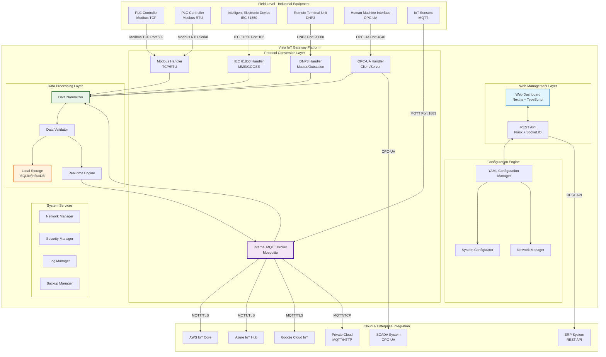
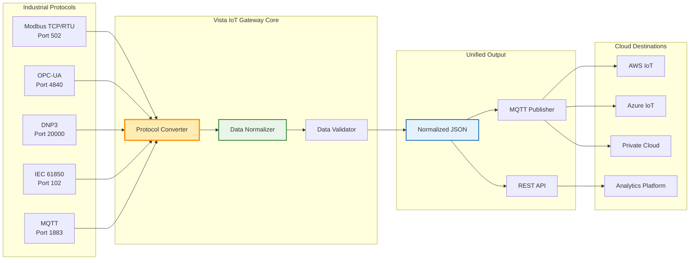
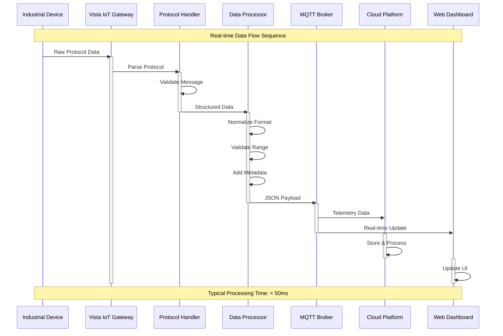
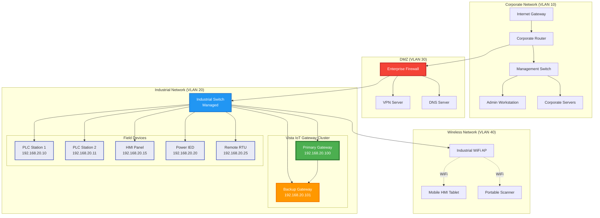
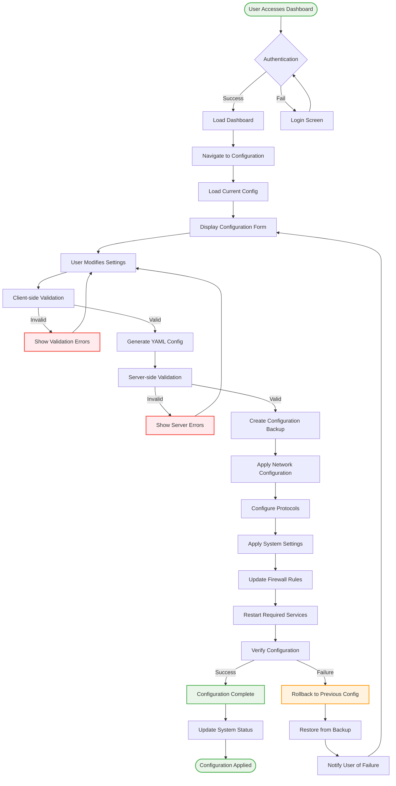
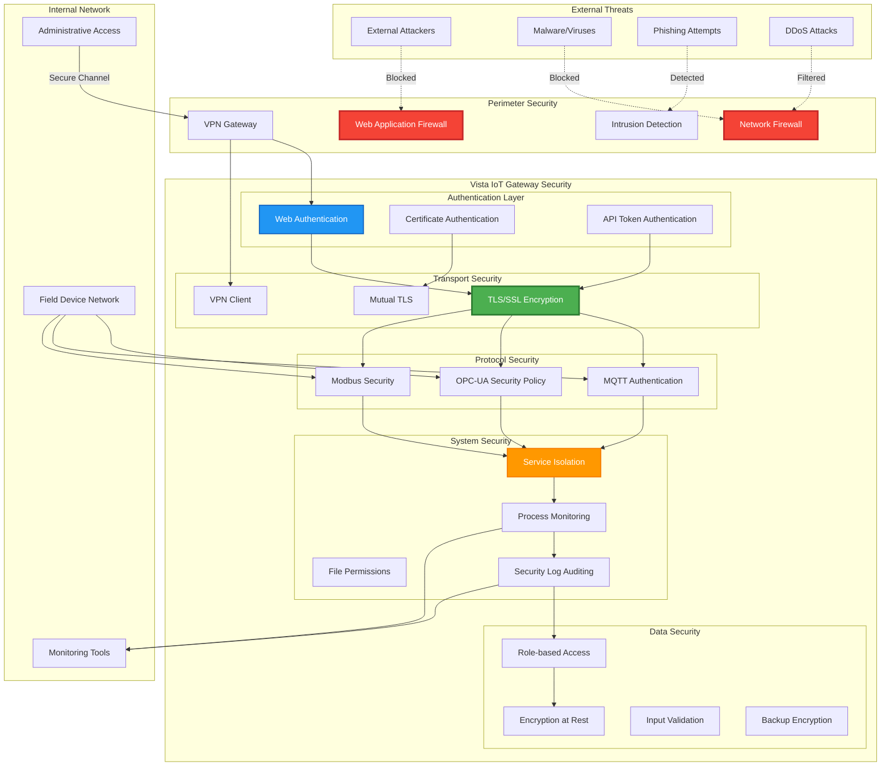
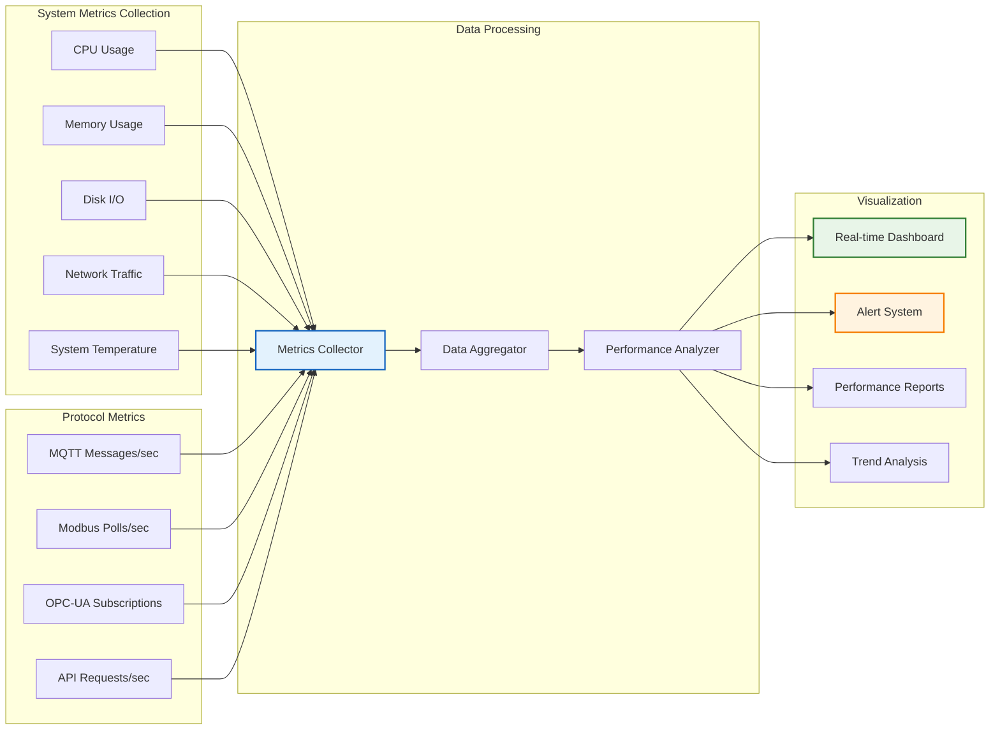
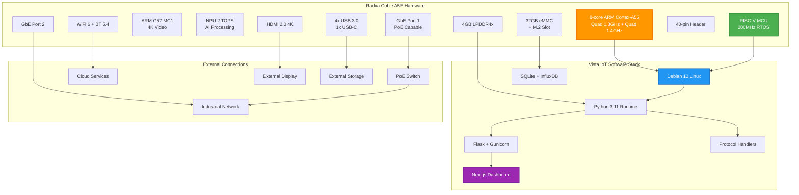

# Vista IoT System Diagrams & Architecture

Comprehensive visual documentation of the Vista IoT Gateway Platform architecture, data flows, and system components.

<div align="center">
  
</div>

## 🏗️ Complete System Architecture

### Full Industrial IoT Gateway Overview

<div align="center">
  
</div>

**Complete end-to-end architecture** showing all components from field devices to cloud platforms, including protocol conversions, data processing, and system management layers.

### Compact System Overview

<div align="center">
  
</div>

**Simplified architectural view** highlighting the core gateway functionality and primary data flow paths for quick understanding.

---

## 🔄 Interactive System Flow Diagrams

### Overall System Architecture with Data Flow



### Protocol Communication Matrix



### Real-time Data Processing Pipeline



### Network Topology & Security Architecture



### Configuration Management Workflow



### Security Implementation Architecture



## 📊 Performance Monitoring Dashboard

### System Metrics Flow



---

## 🔧 Hardware Integration Diagrams

### Radxa Cubie A5E Integration



---

## 📋 Quick Reference

### Port Allocation Table

| Service | Port | Protocol | Purpose |
|---------|------|----------|----------|
| **Web Dashboard** | 8080 | HTTP/HTTPS | Main configuration interface |
| **MQTT Broker** | 1883 | MQTT | Internal message broker |
| **MQTT Secure** | 8883 | MQTTS | Secure MQTT with TLS |
| **Modbus TCP** | 502 | Modbus | Industrial device communication |
| **OPC-UA** | 4840 | OPC-UA | Industrial automation protocol |
| **DNP3** | 20000 | DNP3 | SCADA communication |
| **IEC 61850** | 102 | IEC61850 | Power system communication |
| **SSH Management** | 22 | SSH | System administration |
| **HTTP API** | 8080 | HTTP | REST API endpoints |
| **WebSocket** | 8080 | WS | Real-time updates |

### Configuration File Hierarchy

```
/opt/vista-iot-gateway/
├── config/
│   ├── gateway.yaml           # Main configuration
│   ├── protocols/
│   │   ├── modbus.json       # Modbus settings
│   │   ├── opcua.json        # OPC-UA settings
│   │   ├── dnp3.json         # DNP3 settings
│   │   └── iec61850.json     # IEC 61850 settings
│   ├── network/
│   │   ├── ethernet.conf     # Ethernet configuration
│   │   ├── wifi.conf         # WiFi configuration
│   │   └── firewall.rules    # Firewall rules
│   └── security/
│       ├── certificates/     # SSL certificates
│       ├── keys/            # Private keys
│       └── users.json       # User accounts
├── data/
│   ├── sqlite/              # Local database files
│   ├── influxdb/           # Time-series data
│   └── logs/               # Application logs
└── backups/
    ├── daily/              # Daily configuration backups
    ├── weekly/             # Weekly system backups
    └── manual/             # Manual backup snapshots
```

---

🎯 **Next Steps**: Explore our [Hardware Guide](hardware) for detailed board specifications or check the [API Reference](api-reference) for integration examples.

