# Vista IoT Supported Hardware

Comprehensive guide to single board computers tested and supported by Vista IoT Gateway Platform.

<div align="center">
  
</div>

## 🏗️ Hardware Requirements

Vista IoT Gateway Platform is designed to run on ARM-based Single Board Computers with industrial-grade reliability.

### Minimum System Requirements

| Component | Minimum | Recommended | Industrial |
|-----------|---------|-------------|------------|
| **CPU** | Quad-core ARM Cortex-A55 | 8-core ARM Cortex-A55+ | 8-core + RISC-V MCU |
| **RAM** | 2GB LPDDR4 | 4GB LPDDR4 | 8GB LPDDR4 |
| **Storage** | 8GB eMMC | 32GB eMMC | 64GB eMMC |
| **Network** | 1x Gigabit Ethernet | 2x Gigabit Ethernet | 2x GbE + WiFi 6 |
| **Operating Temperature** | 0°C to 70°C | -20°C to 80°C | -40°C to 85°C |
| **I/O Interfaces** | USB 3.0, GPIO | USB 3.0, PCIe, GPIO | USB 3.0, PCIe, M.2, GPIO |

## 🔧 Tested & Supported Boards

### Radxa Cubie A5E - **Primary Test Platform**

<div align="center">
  
</div>

#### **8-Core Tiny AIoT SBC - Industrial Grade**

**Why Chosen as Primary Platform:**
- ✅ **Industrial Temperature Range**: -40°C to 85°C operation
- ✅ **Dual Gigabit Ethernet**: Perfect for industrial network segmentation
- ✅ **RISC-V MCU**: Real-time operations for critical control tasks
- ✅ **WiFi 6 & Bluetooth 5.4**: Latest wireless standards
- ✅ **Compact Design**: 148x100mm form factor
- ✅ **PoE Support**: Power-over-Ethernet for easy deployment

#### **Technical Specifications**

| Feature | Specification |
|---------|---------------|
| **CPU** | 8-core ARM Cortex-A55 (Quad 1.8GHz + Quad 1.4GHz) |
| **MCU** | Single-core RISC-V up to 200MHz (RTOS capable) |
| **GPU** | ARM G57 MC1 with 4K video processing |
| **AI** | NPU with 2 TOPS computing power (T527 version) |
| **Memory** | Up to 4GB LPDDR4x |
| **Storage** | Up to 32GB eMMC + M.2 M Key connector |
| **Network** | 2x Gigabit Ethernet (PoE support) + WiFi 6 + BT 5.4 |
| **Video** | HDMI 2.0 4K@60fps output, 4K@25fps encoding |
| **USB** | 4x USB 3.0 Type-A, 1x USB 2.0 Type-C |
| **GPIO** | 40-pin header |
| **Size** | 148mm x 100mm |
| **Temperature** | -40°C to 85°C (Industrial) / 0°C to 70°C (Consumer) |

#### **Vista IoT Performance Results**

| Metric | Result | Target |
|--------|--------|---------|
| **Concurrent Modbus Devices** | 150+ | 100+ |
| **MQTT Messages/sec** | 1200+ | 1000+ |
| **OPC-UA Nodes** | 12,000+ | 10,000+ |
| **Web Response Time** | <50ms | <100ms |
| **Boot to Operational** | 22s | <30s |
| **Power Consumption** | 8W avg | <15W |

#### **Industrial Features**


---

### Banana Pi BPI-F3 - **RISC-V Alternative**

<div align="center">
  
</div>

#### **Pure RISC-V SBC for Edge Computing**

**Why Included:**
- ✅ **Pure RISC-V Architecture**: SpacemiT K1 8-core RISC-V chip
- ✅ **AI Capabilities**: 2.0 TOPS AI computing power
- ✅ **Dual Gigabit Ethernet**: Industrial networking ready
- ✅ **PCIe Expansion**: M.2 and Mini PCIe support
- ✅ **Cost Effective**: Alternative to ARM platforms

#### **Technical Specifications**

| Feature | Specification |
|---------|---------------|
| **CPU** | SpacemiT K1 8-core RISC-V chip |
| **AI** | 2.0 TOPS from RISC-V Core |
| **Memory** | 4GB LPDDR4 (up to 8GB) |
| **Storage** | 16GB eMMC + 4M SPI NOR + 32M SPI NAND |
| **Network** | 2x Gigabit Ethernet (PoE capable) + WiFi 5 + BT 4.2 |
| **Video** | HDMI 1.4 up to 1080p@60fps |
| **Camera** | MIPI-CSI dual camera support |
| **USB** | 4x USB 3.0 Type-A + 1x USB 2.0 Type-C OTG |
| **PCIe** | 2x PCIe 2.1 lanes + Mini PCIe |
| **GPIO** | 26-pin header |
| **Size** | 148mm x 100mm |
| **Weight** | 200g |

#### **Vista IoT Compatibility Status**

| Feature | Status | Notes |
|---------|--------|-------|
| **Basic Deployment** | ✅ **Fully Supported** | Complete platform support |
| **MQTT Broker** | ✅ **Tested** | Mosquitto runs natively |
| **Modbus TCP/RTU** | ✅ **Tested** | PyModbus compatible |
| **OPC-UA** | ⚠️ **Limited** | Some performance constraints |
| **Web Dashboard** | ✅ **Tested** | Full Next.js support |
| **Docker Support** | 🔄 **In Progress** | RISC-V container support |

---

## 🏭 Board Selection Guide

### For Production Industrial Deployments

```mermaid
flowchart TD
    A[Industrial Requirements?] -->|Yes| B{Temperature Range?}
    A -->|No| F[Radxa ROCK Series]
    
    B -->|Wide -40°C to 85°C| C[Radxa Cubie A5E Industrial]
    B -->|Standard 0°C to 70°C| D[Radxa Cubie A5E Consumer]
    
    C --> C1[✅ Harsh Environment Ready]
    D --> D1[✅ Standard Industrial Use]
    
    A -->|RISC-V Interest| E[Banana Pi BPI-F3]
    E --> E1[✅ Open Architecture]
    
    F --> F1[✅ Development & Testing]
    
    style C fill:#f96,stroke:#333,stroke-width:3px
    style D fill:#9f9,stroke:#333,stroke-width:2px
    style E fill:#69f,stroke:#333,stroke-width:2px
    style F fill:#ff9,stroke:#333,stroke-width:2px
```



### Use Case Recommendations

#### **🏭 Heavy Industrial (Recommended: Radxa Cubie A5E Industrial)**
- Manufacturing floors with extreme temperatures
- Outdoor installations
- Chemical processing plants
- Power generation facilities
- 24/7 critical operations

#### **🏢 Commercial Industrial (Recommended: Radxa Cubie A5E Consumer)**
- Building automation
- Indoor manufacturing
- Warehouse management
- Office IoT deployments
- HVAC control systems

#### **🔬 Research & Development (Recommended: Banana Pi BPI-F3)**
- RISC-V architecture exploration
- AI/ML edge computing research
- Cost-sensitive deployments
- Educational institutions
- Proof-of-concept projects

## 📊 Performance Comparison

### Protocol Performance by Board

| Board | MQTT msg/s | Modbus Devices | OPC-UA Nodes | Boot Time | Power |
|-------|------------|----------------|---------------|-----------|-------|
| **Radxa Cubie A5E** | 1200+ | 150+ | 12,000+ | 22s | 8W |
| **Banana Pi BPI-F3** | 800+ | 100+ | 8,000+ | 28s | 12W |
| **Radxa ROCK 5B** | 1500+ | 180+ | 15,000+ | 18s | 15W |

### Network Performance


## 🔧 Installation Guides by Board

### Radxa Cubie A5E Setup

1. **Download Vista IoT Image**
   ```bash
   wget https://github.com/Vista-IOT/releases/vista-iot-cubie-a5e-v1.0.img.xz
   ```

2. **Flash to eMMC/SD Card**
   ```bash
   xzcat vista-iot-cubie-a5e-v1.0.img.xz | sudo dd of=/dev/mmcblk0 bs=1M status=progress
   ```

3. **First Boot Configuration**
   ```bash
   # SSH into the board
   ssh vista@192.168.1.100
   
   # Run Vista IoT setup
   sudo vista-iot-setup
   ```

### Banana Pi BPI-F3 Setup

1. **RISC-V Image Preparation**
   ```bash
   # Download RISC-V compatible image
   wget https://github.com/Vista-IOT/releases/vista-iot-bpi-f3-riscv-v1.0.img.xz
   ```

2. **Installation Process**
   ```bash
   # Flash image
   xzcat vista-iot-bpi-f3-riscv-v1.0.img.xz | sudo dd of=/dev/sdb bs=1M status=progress
   
   # Enable RISC-V optimizations
   sudo systemctl enable vista-iot-riscv-optimizations
   ```

## 🛠️ Hardware Testing Results

### Stress Testing (72-hour continuous operation)

#### **Radxa Cubie A5E Results**
- ✅ **Temperature Stability**: Max 65°C under full load
- ✅ **Network Reliability**: 0% packet loss over 72 hours
- ✅ **Protocol Uptime**: 99.99% availability
- ✅ **Memory Stability**: No memory leaks detected
- ✅ **Power Efficiency**: Consistent 8W consumption

#### **Banana Pi BPI-F3 Results**
- ✅ **RISC-V Performance**: Stable under industrial workloads
- ⚠️ **Temperature**: Max 72°C (higher than ARM)
- ✅ **Protocol Compatibility**: 95% feature parity
- ✅ **AI Processing**: 2 TOPS sustained performance
- ⚠️ **Power Consumption**: 12W average (higher than ARM)

## 🔗 Additional Resources

### Board Documentation
- [Radxa Cubie A5E Official Docs](https://docs.radxa.com/cubie/a5e/)
- [Banana Pi BPI-F3 Wiki](https://wiki.banana-pi.org/Banana_Pi_BPI-F3)

### Vista IoT Optimization Guides
- [Industrial Deployment Guide](tutorials#industrial-deployment)
- [Performance Tuning](tutorials#performance-optimization)
- [Hardware Selection Calculator](https://vista-iot.github.io/hardware-calculator)

---

⚡ **Ready to Deploy?** Check our [Getting Started Guide](getting-started) for step-by-step installation instructions for your chosen hardware platform.

