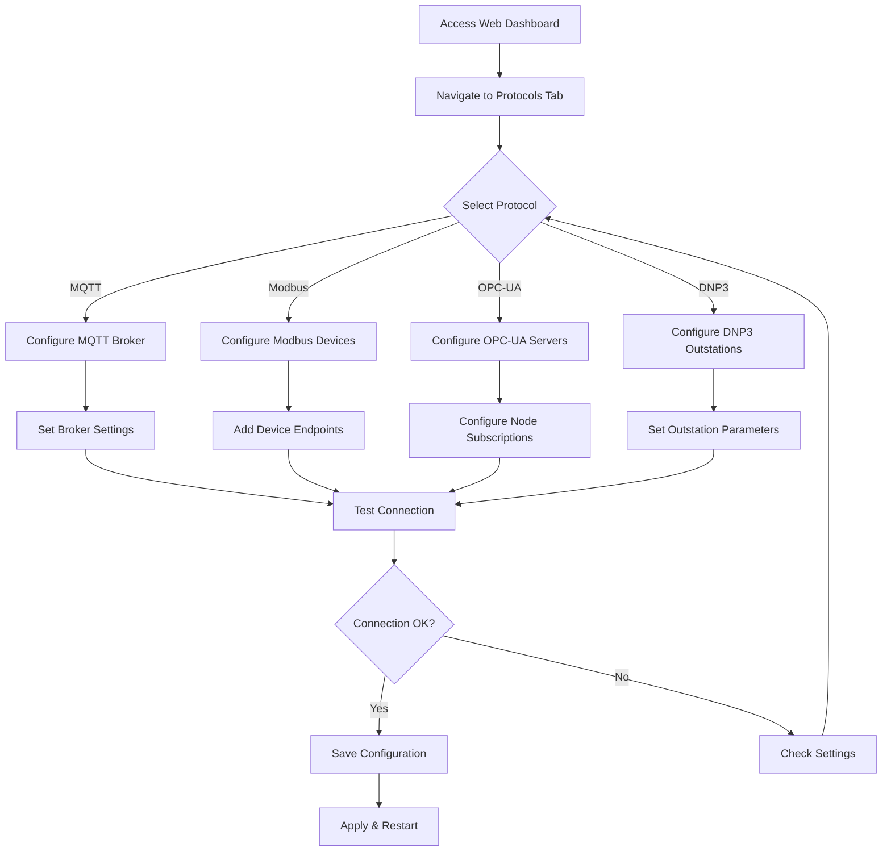
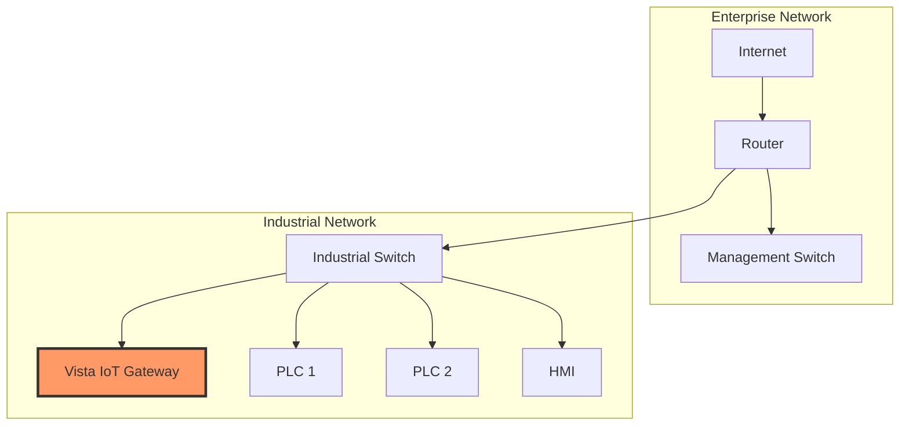
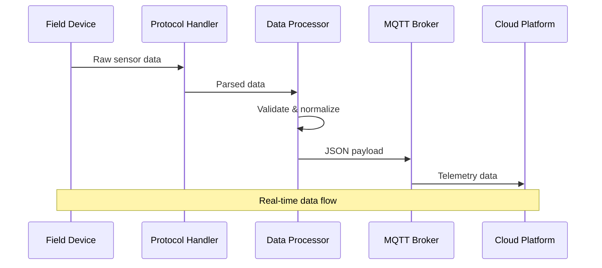

# Vista IoT Tutorials

Step-by-step tutorials to help you build with Vista IoT Gateway Platform.

<div align="center">
  
</div>

## Tutorial 1: Building Your First IoT Dashboard

Learn how to create a real-time dashboard for your IoT devices.

### What You'll Build
- A web dashboard showing live sensor data
- Charts and graphs for data visualization
- Device status monitoring

### Prerequisites
- Completed [Getting Started](getting-started) guide
- Basic HTML/CSS/JavaScript knowledge

### Steps

1. **Set up the project structure**
   ```bash
   mkdir iot-dashboard
   cd iot-dashboard
   npm init -y
   ```

2. **Install dependencies**
   ```bash
   npm install express socket.io chart.js
   ```

3. **Create the server**
   ```javascript
   const express = require('express');
   const http = require('http');
   const socketIo = require('socket.io');
   
   const app = express();
   const server = http.createServer(app);
   const io = socketIo(server);
   
   // Your server code here
   ```

## Tutorial 2: Protocol Setup Guide

Learn how to configure industrial protocols on your Vista IoT Gateway.

### Protocol Setup Flow



### MQTT Configuration

1. **Enable MQTT Broker**
   ```yaml
   protocols:
     mqtt:
       enabled: true
       broker:
         internal: true
         port: 1883
         ssl_enabled: false
   ```

2. **Configure Topics**
   ```yaml
   topics:
     telemetry: "vista/{device_id}/telemetry"
     attributes: "vista/{device_id}/attributes"
     commands: "vista/{device_id}/commands"
   ```

3. **Test MQTT Connection**
   ```bash
   # Publish test message
   mosquitto_pub -h 192.168.1.100 -t "vista/test/telemetry" -m '{"temperature": 25.5}'
   
   # Subscribe to messages
   mosquitto_sub -h 192.168.1.100 -t "vista/+/telemetry"
   ```

### Modbus Configuration

1. **Add Modbus Device**
   ```yaml
   protocols:
     modbus:
       enabled: true
       servers:
         - name: "plc_line_1"
           host: "192.168.1.50"
           port: 502
           timeout: 5
           devices:
             - unit_id: 1
               name: "temperature_sensor"
               registers:
                 - address: 0
                   function_code: 4
                   data_type: "float32"
                   tag_name: "temperature"
   ```

2. **Register Mapping**
   | Address | Function Code | Data Type | Description |
   |---------|---------------|-----------|-------------|
   | 0-99 | 4 (Input Registers) | int16/float32 | Sensor readings |
   | 100-199 | 3 (Holding Registers) | int16 | Configuration |
   | 200-299 | 1 (Coils) | bool | Digital outputs |

### OPC-UA Configuration

1. **Add OPC-UA Server**
   ```yaml
   protocols:
     opcua:
       enabled: true
       servers:
         - name: "automation_server"
           endpoint: "opc.tcp://192.168.1.60:4840"
           security_mode: "None"
           subscriptions:
             - node_id: "ns=2;i=2"
               display_name: "Motor_Speed"
               sampling_interval: 1000
   ```

2. **Node Browsing**
   ```python
   from opcua import Client
   
   client = Client("opc.tcp://192.168.1.60:4840")
   client.connect()
   
   # Browse available nodes
   root = client.get_root_node()
   objects = client.get_objects_node()
   print("Available objects:")
   for child in objects.get_children():
       print(f"  {child.get_display_name()}: {child.nodeid}")
   ```

## Tutorial 3: Network Configuration

Configure network settings for industrial environments.

### Network Topology Setup



### Static IP Configuration

1. **Configure Ethernet**
   ```yaml
   networking:
     ethernet:
       enabled: true
       interface: "eth0"
       dhcp: false
       static_ip: "192.168.20.100"
       netmask: "255.255.255.0"
       gateway: "192.168.20.1"
       dns_servers:
         - "8.8.8.8"
         - "8.8.4.4"
   ```

2. **Firewall Configuration**
   ```yaml
   firewall:
     enabled: true
     ssh_port: 22
     web_dashboard_port: 8080
     allowed_protocols:
       - "mqtt"    # Port 1883
       - "modbus"  # Port 502
       - "opcua"   # Port 4840
       - "dnp3"    # Port 20000
   ```

## Tutorial 4: Data Flow Implementation

Implement end-to-end data flow from field devices to cloud.

### Data Processing Pipeline



### Data Transformation

1. **Raw Data Input**
   ```json
   {
     "modbus_register_0": 235,
     "modbus_register_1": 602,
     "timestamp": "2024-01-15T10:30:00Z"
   }
   ```

2. **Processed Output**
   ```json
   {
     "device_id": "plc_line_1",
     "temperature": 23.5,
     "humidity": 60.2,
     "timestamp": "2024-01-15T10:30:00Z",
     "location": "Factory Floor 1",
     "quality": "good"
   }
   ```

## Tutorial 5: Security Implementation

Secure your Vista IoT Gateway for production deployment.

### Security Checklist

- [ ] Enable UFW firewall
- [ ] Configure SSL/TLS certificates
- [ ] Set up VPN access
- [ ] Enable MQTT authentication
- [ ] Configure OPC-UA security
- [ ] Regular security updates
- [ ] Log monitoring
- [ ] Backup procedures

### SSL/TLS Configuration

1. **Generate SSL Certificate**
   ```bash
   sudo openssl req -x509 -nodes -days 365 -newkey rsa:2048 \
     -keyout /etc/ssl/private/vista-iot.key \
     -out /etc/ssl/certs/vista-iot.crt
   ```

2. **Configure HTTPS**
   ```yaml
   web_dashboard:
     ssl_enabled: true
     ssl_cert: "/etc/ssl/certs/vista-iot.crt"
     ssl_key: "/etc/ssl/private/vista-iot.key"
     port: 8443
   ```

## Tutorial 6: Troubleshooting Common Issues

### Connection Issues

1. **MQTT Connection Failed**
   ```bash
   # Check MQTT broker status
   sudo systemctl status mosquitto
   
   # Test broker connectivity
   mosquitto_pub -h localhost -t test -m "hello"
   
   # Check firewall rules
   sudo ufw status
   ```

2. **Modbus Connection Timeout**
   ```bash
   # Test network connectivity
   ping 192.168.1.50
   
   # Check port accessibility
   nmap -p 502 192.168.1.50
   
   # Verify Modbus configuration
   modpoll -m tcp -a 1 -r 1 -c 10 192.168.1.50
   ```

3. **OPC-UA Security Issues**
   ```bash
   # Check OPC-UA server status
   netstat -tlnp | grep :4840
   
   # Test with OPC client
   opcua-client opc.tcp://192.168.1.60:4840
   ```

### Performance Optimization

1. **Monitor System Resources**
   ```bash
   # Check CPU and memory usage
   htop
   
   # Monitor disk usage
   df -h
   
   # Check network throughput
   iftop
   ```

2. **Optimize Protocol Settings**
   - Adjust polling intervals
   - Optimize register mappings
   - Configure appropriate timeouts
   - Use efficient data types

---

🔧 **Need Help?** Check our [API Reference](api-reference) for detailed technical information or visit our [Contributing Guide](contributing) to connect with the development team.

